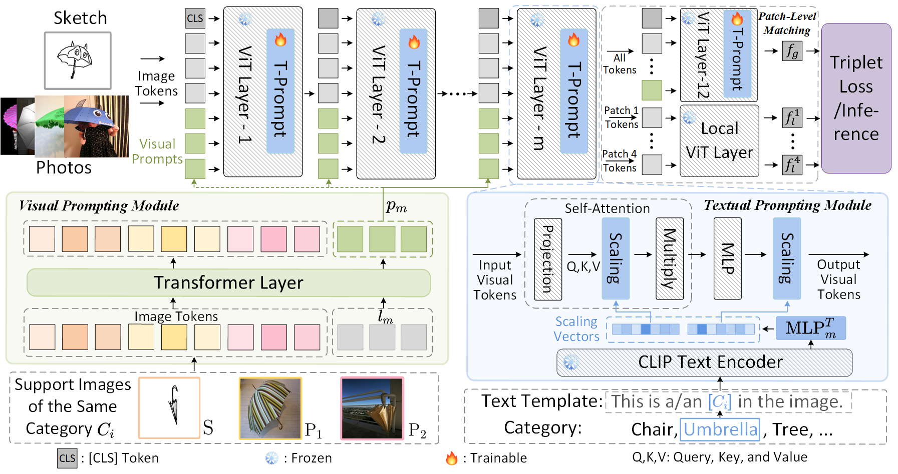

# Sketch_LVM
### Official repository of _Dual-Modal Prompting for Sketch-Based Image Retrieval_
## Pipeline




## Requirements

### Installation

```bash
pip install -r requirements.txt
(we use /torch 1.13.1 /torchvision 0.14.1 /cuda 11.7 /12G for training and evaluation.
```

### Datasets

- For Fine-grained ZS-SBIR:
  - [Sketchy](https://github.com/AnjanDutta/sem-pcyc/) (basic) dataset having fine-grained sketch-photo associations.

- For Category-level ZS-SBIR:
  - [Sketchy](https://drive.google.com/file/d/1vGtssYgM6_r0ph8f_ZPWzIHvHL0yS8CN/view?usp=sharing) (extended).
  - [TUBerlin](https://github.com/AnjanDutta/sem-pcyc/).


## Training

We utilize 1 GPU for training.

```bash
sh train.sh
```

**or you can directly test with following yml and commands:**

## Evaluation

```bash
sh test.sh
```

For evaluation only, you could download our trained model from [Google](https://drive.google.com/file/d/1wOLuKUQCIbrQ4B49iZuuUPd7mK9QChn0/view?usp=sharing).

The pretrained model and other files can also be downloaded from [Google](https://drive.google.com/drive/folders/1j6hko7Ysl3daUG6zJLqrStMrY_381_KS?usp=sharing).

## Acknowledgement

Codebase from [Sketch_LVM](https://github.com/aneeshan95/Sketch_LVM) and CLIP.

 ## Contact

If you have any question, please feel free to contact us. 
Gao liying: gaoliying at mail.nwpu.edu.cn
